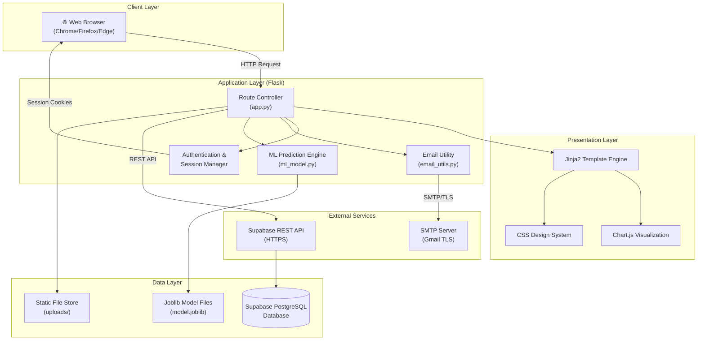
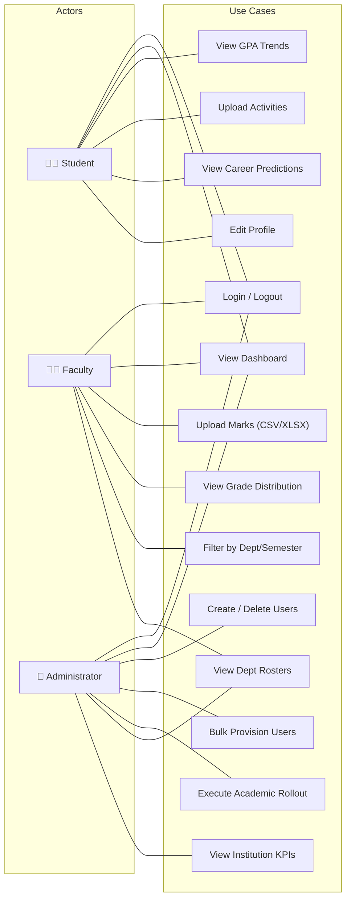
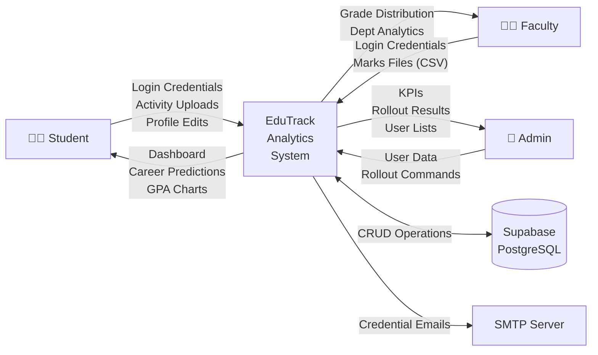
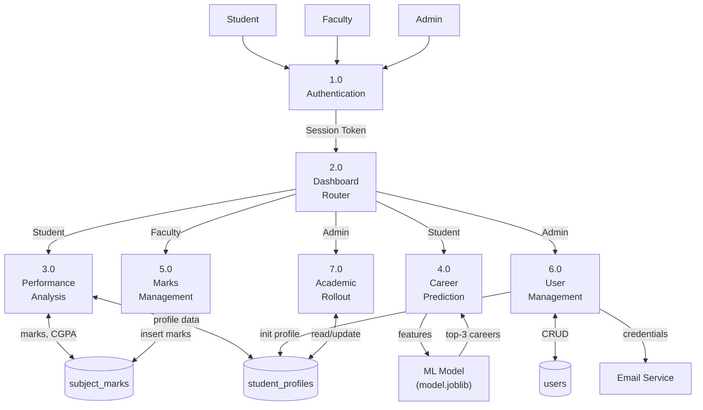
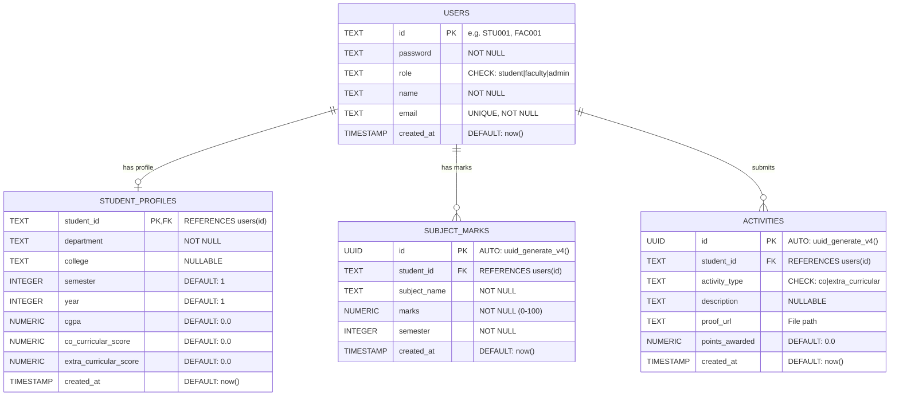
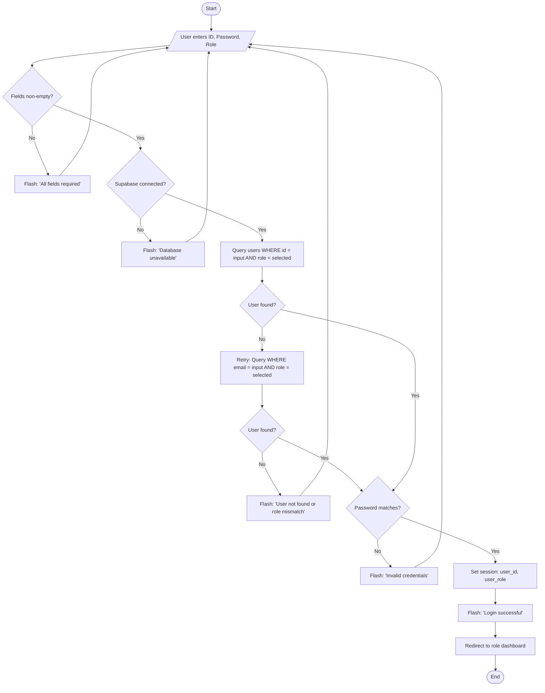
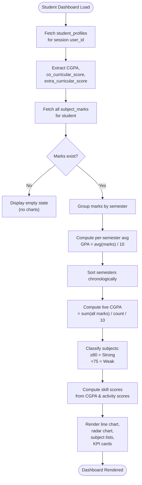
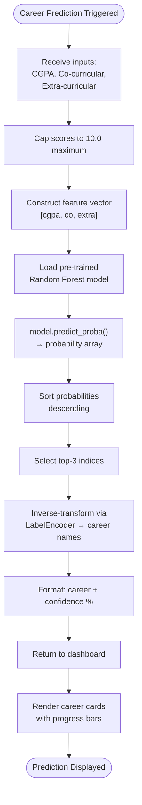

# Software Requirements Specification (SRS)

## Student Performance Analyzer and Career Trajectory System

**Document Version:** 1.0
**Date:** April 5, 2026
**Prepared for:** Charotar University of Science and Technology (CHARUSAT)
**Standard:** IEEE 830-1998 / ISO/IEC/IEEE 29148:2018

---

# Table of Contents

1. [Introduction](#1-introduction)
   - 1.1 Purpose
   - 1.2 Scope
   - 1.3 Definitions, Acronyms, and Abbreviations
   - 1.4 References
   - 1.5 Document Overview
2. [Overall Description](#2-overall-description)
   - 2.1 Product Perspective
   - 2.2 Product Functions
   - 2.3 User Classes and Characteristics
   - 2.4 Operating Environment
   - 2.5 Design and Implementation Constraints
   - 2.6 User Documentation
   - 2.7 Assumptions and Dependencies
3. [Functional Requirements](#3-functional-requirements)
4. [External Interface Requirements](#4-external-interface-requirements)
5. [Non-Functional Requirements](#5-non-functional-requirements)
6. [Other Requirements](#6-other-requirements)
7. [Appendices](#7-appendices)
8. [Index](#8-index)

---

# 1. Introduction

## 1.1 Purpose

The purpose of this Software Requirements Specification (SRS) document is to provide a comprehensive and unambiguous description of the functional and non-functional requirements for the **Student Performance Analyzer and Career Trajectory System** (hereafter referred to as "EduTrack Analytics"). This document is intended for use by the development team, academic stakeholders, quality assurance personnel, and university administrators at CHARUSAT to ensure a shared understanding of the system's capabilities, constraints, and expected behavior.

This document conforms to the IEEE 830-1998 standard for Software Requirements Specifications and serves as the authoritative reference for system design, implementation, testing, and validation.

## 1.2 Scope

**EduTrack Analytics** is a web-based academic performance management system designed exclusively for the B.Tech departments of Charotar University of Science and Technology (CHARUSAT). The system provides the following core capabilities:

1. **Centralized Academic Tracking** — Aggregation and visualization of student marks across all eight semesters, computed dynamically into CGPA metrics.
2. **Co-Curricular and Extra-Curricular Activity Management** — A point-based system enabling students to upload achievement certificates with automated score allocation.
3. **AI-Driven Career Trajectory Prediction** — A machine learning module employing a Random Forest Classifier to predict optimal career paths based on a student's CGPA, co-curricular, and extra-curricular scores.
4. **Role-Based Dashboards** — Distinct analytical interfaces for Students, Faculty, and Administrators, each providing contextually relevant KPIs and operational tools.
5. **Automated Academic Rollout** — An administrative engine that evaluates CGPA thresholds to determine semester promotion or retention.
6. **Automated Credential Distribution** — Email-based dispatch of system-generated passwords to newly provisioned users.

**Out of Scope:** This system does not manage student fee payments, physical attendance hardware integration, hostel management, or examination scheduling.

## 1.3 Definitions, Acronyms, and Abbreviations

| Term | Definition |
|------|-----------|
| **SRS** | Software Requirements Specification |
| **CGPA** | Cumulative Grade Point Average |
| **SGPA** | Semester Grade Point Average |
| **GPA** | Grade Point Average |
| **ML** | Machine Learning |
| **RF** | Random Forest (classification algorithm) |
| **API** | Application Programming Interface |
| **CRUD** | Create, Read, Update, Delete |
| **RBAC** | Role-Based Access Control |
| **SMTP** | Simple Mail Transfer Protocol |
| **BaaS** | Backend as a Service |
| **KPI** | Key Performance Indicator |
| **CSV** | Comma-Separated Values |
| **XLSX** | Microsoft Excel Open XML Spreadsheet |
| **TLS** | Transport Layer Security |
| **UUID** | Universally Unique Identifier |
| **CHARUSAT** | Charotar University of Science and Technology |
| **NAAC** | National Assessment and Accreditation Council |

## 1.4 References

| # | Reference | Description |
|---|-----------|-------------|
| 1 | IEEE 830-1998 | IEEE Recommended Practice for SRS |
| 2 | ISO/IEC/IEEE 29148:2018 | Systems and Software Engineering — Life Cycle Processes — Requirements Engineering |
| 3 | Flask Documentation v3.x | https://flask.palletsprojects.com/ |
| 4 | Supabase Documentation | https://supabase.com/docs |
| 5 | Scikit-learn Documentation | https://scikit-learn.org/stable/ |
| 6 | Chart.js Documentation v4.x | https://www.chartjs.org/docs/ |
| 7 | CHARUSAT Academic Manual | Internal university academic policies and grading rubric |

## 1.5 Document Overview

This document is organized into eight major sections:

- **Section 1 (Introduction):** Establishes the purpose, scope, and terminology.
- **Section 2 (Overall Description):** Provides system context, user profiles, environment, and constraints.
- **Section 3 (Functional Requirements):** Details every functional requirement with Input-Process-Output specifications.
- **Section 4 (External Interface Requirements):** Describes UI, software, hardware, and communication interfaces.
- **Section 5 (Non-Functional Requirements):** Specifies performance, security, reliability, and quality attributes.
- **Section 6 (Other Requirements):** Covers legal, safety, and quality concerns.
- **Section 7 (Appendices):** Contains sample data, example outputs, and all system diagrams.
- **Section 8 (Index):** Alphabetical term index for rapid document navigation.

---

# 2. Overall Description

## 2.1 Product Perspective

EduTrack Analytics is a **self-contained web application** that operates as an independent system within the CHARUSAT academic ecosystem. It is not a component of a larger software suite but integrates with external services for data persistence and email delivery.

### 2.1.1 System Architecture Diagram

### 2.1.2 System Context

The system is architected in a **three-tier model**:

1. **Client Tier:** Standard web browsers render server-side Jinja2 templates with Chart.js for interactive data visualization.
2. **Application Tier:** A Python Flask server handles routing, authentication, business logic, and integrates the scikit-learn based ML prediction engine.
3. **Data Tier:** Supabase (PostgreSQL) serves as the cloud-hosted relational database, accessed exclusively through the Supabase Python SDK's REST API.

## 2.2 Product Functions

The system provides the following high-level functional capabilities:

| ID | Function | Description |
|----|----------|-------------|
| PF-01 | User Authentication | Role-based login for Student, Faculty, and Admin via ID/email and password |
| PF-02 | Student Dashboard | KPI cards (CGPA, co-curricular, extra-curricular scores), GPA trend chart, radar skill chart, and subject proficiency breakdown |
| PF-03 | Faculty Dashboard | Grade distribution charts, departmental filtering, CSV/XLSX marks upload, and activity review |
| PF-04 | Admin Dashboard | Institution-wide KPIs, department CGPA comparison bars, global career prediction doughnut chart |
| PF-05 | User Management | Admin-controlled CRUD for student and faculty accounts with auto-generated passwords |
| PF-06 | Bulk User Provisioning | CSV/XLSX batch upload of user accounts with automated email credential dispatch |
| PF-07 | Marks Upload | Faculty-driven batch upload of subject-wise marks with normalization to 100-point scale |
| PF-08 | Activity Submission | Student self-service upload of co-curricular/extra-curricular certificates with point allocation |
| PF-09 | Career Prediction | Random Forest ML engine producing top-3 career recommendations with confidence percentages |
| PF-10 | Academic Rollout | Admin-initiated semester promotion engine based on CGPA ≥ 5.0 threshold |
| PF-11 | Profile Management | Self-service profile editing with domain-locked email validation |
| PF-12 | Department View | Drill-down roster of students within a specific department with CGPA display |
| PF-13 | Email Notifications | Asynchronous credential emails to newly created users via SMTP/TLS |

## 2.3 User Classes and Characteristics

### 2.3.1 Student

| Attribute | Detail |
|-----------|--------|
| **Population** | Primary user base; all enrolled B.Tech students |
| **Technical Proficiency** | Basic; familiar with web browsers and form-based interfaces |
| **Access** | Personal academic dashboard, activity submission, profile editing |
| **Email Domain Constraint** | Must use `@charusat.edu.in` email addresses |
| **Authentication** | Student ID (e.g., `21CE001`) + admin-generated password |

### 2.3.2 Faculty

| Attribute | Detail |
|-----------|--------|
| **Population** | Teaching staff across departments |
| **Technical Proficiency** | Moderate; capable of preparing CSV/XLSX data files |
| **Access** | Department analytics, marks upload, grade distribution, activity review |
| **Email Domain Constraint** | Must use `@charusat.ac.in` email addresses |
| **Authentication** | Faculty ID or email + admin-generated password |

### 2.3.3 Administrator

| Attribute | Detail |
|-----------|--------|
| **Population** | Limited; system administrators and academic officers |
| **Technical Proficiency** | Advanced; understands institutional workflows |
| **Access** | Full system access — user management, academic rollout, institution-wide analytics, department rosters |
| **Authentication** | Admin ID + password |

## 2.4 Operating Environment

| Component | Specification |
|-----------|--------------|
| **Server Runtime** | Python 3.9+ with Flask web framework |
| **Database** | Supabase (PostgreSQL 15+), cloud-hosted BaaS |
| **ML Runtime** | scikit-learn 1.x, NumPy, Pandas, Joblib |
| **Client** | Any modern web browser (Chrome 90+, Firefox 88+, Edge 90+, Safari 14+) |
| **Email** | SMTP-compatible server (Gmail, Outlook) with TLS on port 587 |
| **Hosting** | Compatible with any WSGI-capable server (Gunicorn, Waitress) or PaaS (Render, Railway, Heroku) |
| **OS** | Platform-independent (Windows, macOS, Linux) |

## 2.5 Design and Implementation Constraints

1. **Email Domain Lock:** Student accounts are strictly validated against `@charusat.edu.in`; faculty against `@charusat.ac.in`. No exceptions are permitted.
2. **Password Policy:** Passwords are generated server-side using `secrets.token_urlsafe(6)`. Self-service password reset is not currently supported.
3. **ML Model:** The Random Forest Classifier is pre-trained on synthetic data and serialized via Joblib. Retraining requires manual execution of the training pipeline.
4. **Marks Normalization:** All uploaded marks are normalized to a 100-point scale regardless of the original total marks basis.
5. **Session-Based Authentication:** Flask server-side sessions are used; no token-based (JWT) authentication is implemented.
6. **No Client-Side Framework:** The frontend uses server-rendered Jinja2 templates with vanilla CSS; no React/Vue/Angular dependency exists.

## 2.6 User Documentation

The following documentation shall accompany the system:

1. **Administrator Manual** — Account provisioning, bulk upload procedures, rollout execution, and system configuration.
2. **Faculty Guide** — Marks upload procedures, CSV format specifications, and dashboard interpretation.
3. **Student Guide** — Dashboard navigation, activity submission workflow, and profile management.
4. **Database Schema Reference** — `supabase_schema.sql` provides the authoritative DDL for all four tables.

## 2.7 Assumptions and Dependencies

### Assumptions
1. All users have access to a stable internet connection and a modern web browser.
2. CHARUSAT's IT infrastructure supports SMTP email delivery for credential distribution.
3. Faculty members prepare marks data in the prescribed CSV/XLSX format prior to upload.
4. The CGPA threshold for academic promotion (≥ 5.0) follows CHARUSAT's official academic policy.

### Dependencies
1. **Supabase** — The system is entirely dependent on Supabase for data persistence. Service unavailability renders the application inoperable.
2. **scikit-learn / Joblib** — The ML prediction module depends on pre-serialized model files (`model.joblib`, `label_encoder.joblib`).
3. **SMTP Server** — Email notifications depend on a configured SMTP service. If SMTP credentials are absent, emails are silently skipped.
4. **Chart.js CDN** — Client-side visualizations depend on the Chart.js library loaded from `cdn.jsdelivr.net`.

---

# 3. Functional Requirements

## 3.1 User Authentication and Login

### FR-01: User Login

| Attribute | Detail |
|-----------|--------|
| **ID** | FR-01 |
| **Priority** | High |
| **Input** | User ID (or email), password, role selection (Student/Faculty/Admin) |
| **Process** | 1. Validate non-empty fields. 2. Query `users` table by `id` matching the selected `role`. 3. If no match, retry query using `email` field as fallback. 4. Compare submitted password against stored plaintext password. 5. On success, populate Flask session with `user_id` and `user_role`. |
| **Output** | **Success:** Redirect to role-specific dashboard with success flash message. **Failure:** Re-render login page with descriptive error flash message (invalid credentials / user not found / database error). |

### FR-02: User Logout

| Attribute | Detail |
|-----------|--------|
| **ID** | FR-02 |
| **Priority** | High |
| **Input** | Authenticated user session |
| **Process** | Clear all Flask session variables via `session.clear()`. |
| **Output** | Redirect to login page with informational logout flash message. |

### FR-03: Session Management

| Attribute | Detail |
|-----------|--------|
| **ID** | FR-03 |
| **Priority** | High |
| **Input** | Any HTTP request to a protected route |
| **Process** | 1. Check for `user_role` in Flask session. 2. If absent, redirect to login. 3. If present but mismatched to the route's required role, redirect to login. |
| **Output** | Access granted to the protected resource, or redirect to login page. |

## 3.2 Role-Based Access Control

### FR-04: Automatic Dashboard Routing

| Attribute | Detail |
|-----------|--------|
| **ID** | FR-04 |
| **Priority** | High |
| **Input** | Authenticated user accessing the root URL (`/`) |
| **Process** | Inspect `session['user_role']` and redirect: `student` → `/student`, `faculty` → `/faculty`, `admin` → `/admin`. If unauthenticated, render the public landing page. |
| **Output** | Role-appropriate dashboard page. |

### FR-05: Route-Level Access Enforcement

| Attribute | Detail |
|-----------|--------|
| **ID** | FR-05 |
| **Priority** | High |
| **Input** | HTTP request to any role-restricted endpoint |
| **Process** | Each route handler validates `session.get('user_role')` against the required role. Unauthorized access is redirected to login. |
| **Output** | Access granted or forced login redirect. |

## 3.3 Student Data Management

### FR-06: Admin User Creation (Single)

| Attribute | Detail |
|-----------|--------|
| **ID** | FR-06 |
| **Priority** | High |
| **Input** | User ID, name, email, role, optional password, optional department (for students) |
| **Process** | 1. Validate email domain (student: `@charusat.edu.in`, faculty: `@charusat.ac.in`). 2. If password is blank, auto-generate via `secrets.token_urlsafe(6)`. 3. Insert into `users` table. 4. If role is `student`, create corresponding `student_profiles` record. 5. Dispatch credentials email asynchronously. |
| **Output** | Success flash message with confirmation, or error flash on constraint violation (duplicate ID/email). |

### FR-07: Admin Bulk User Provisioning

| Attribute | Detail |
|-----------|--------|
| **ID** | FR-07 |
| **Priority** | Medium |
| **Input** | CSV/XLSX file containing columns: `id`, `name`, `email`, optional `password`, `role`, `department` |
| **Process** | 1. Parse uploaded file into a Pandas DataFrame. 2. Normalize column headers to lowercase. 3. For each row: validate email domain, generate password if absent, insert into `users` and `student_profiles` (if student), dispatch credential email. 4. Skip rows with domain violations silently. |
| **Output** | Success flash with total count of provisioned accounts. |

### FR-08: Admin User Deletion

| Attribute | Detail |
|-----------|--------|
| **ID** | FR-08 |
| **Priority** | Medium |
| **Input** | User ID of the target user |
| **Process** | Execute `DELETE` on the `users` table with cascading deletion to `student_profiles`, `subject_marks`, and `activities` via foreign key constraints. |
| **Output** | Success confirmation flash message. |

### FR-09: Profile Management

| Attribute | Detail |
|-----------|--------|
| **ID** | FR-09 |
| **Priority** | Medium |
| **Input** | Name, email, college, department, year, semester (student-specific fields) |
| **Process** | 1. Validate email domain based on role. 2. Update `users` table for name/email. 3. If student, update `student_profiles` for academic fields. |
| **Output** | Profile page re-rendered with updated data and success flash. |

## 3.4 Performance Analysis

### FR-10: Subject-Wise Marks Upload

| Attribute | Detail |
|-----------|--------|
| **ID** | FR-10 |
| **Priority** | High |
| **Input** | CSV/XLSX file (columns: `student_id`/`id`, `marks`; optional: `subject_name`, `semester`), batch subject name, batch semester, total marks basis |
| **Process** | 1. Parse and normalize column headers. 2. Map `id` to `student_id` if needed. 3. For each row: extract marks, handle absent/invalid values as 0.0, normalize to 100-point scale using `(raw / total) × 100`. 4. Insert into `subject_marks` table. |
| **Output** | Success flash with count of processed records. |

### FR-11: Student GPA Trend Analysis

| Attribute | Detail |
|-----------|--------|
| **ID** | FR-11 |
| **Priority** | High |
| **Input** | Authenticated student session |
| **Process** | 1. Fetch all `subject_marks` for the student. 2. Group by semester. 3. Compute per-semester average, divide by 10 to convert to GPA scale. 4. Sort chronologically. 5. Dynamically compute live CGPA from all marks. |
| **Output** | Line chart (Chart.js) displaying GPA trend across semesters; CGPA KPI card. |

### FR-12: Subject Proficiency Classification

| Attribute | Detail |
|-----------|--------|
| **ID** | FR-12 |
| **Priority** | Medium |
| **Input** | Student's subject marks from database |
| **Process** | Classify subjects: marks ≥ 80 → "Strong Nodes"; marks < 75 → "Improvement Zones". |
| **Output** | Two categorized lists displayed with color-coded badges (green for strong, red for weak). |

### FR-13: Faculty Grade Distribution

| Attribute | Detail |
|-----------|--------|
| **ID** | FR-13 |
| **Priority** | Medium |
| **Input** | Optional department filter, optional semester filter |
| **Process** | 1. Fetch all marks, optionally filtered. 2. Bucket into grade bands: A+ (≥90), A (≥80), B+ (≥70), B (≥60), C (≥50), F (<50). 3. Count unique courses. 4. Compute class average GPA. |
| **Output** | Grade distribution bar chart, KPI cards for total students, active courses, and class avg GPA. |

### FR-14: Admin Departmental CGPA Comparison

| Attribute | Detail |
|-----------|--------|
| **ID** | FR-14 |
| **Priority** | Medium |
| **Input** | All student profiles |
| **Process** | Group profiles by department, compute average CGPA per department. |
| **Output** | Bar chart comparing department-level average CGPAs; institution-wide average KPI card. |

## 3.5 Prediction Module (ML)

### FR-15: Career Trajectory Prediction

| Attribute | Detail |
|-----------|--------|
| **ID** | FR-15 |
| **Priority** | High |
| **Input** | Student's CGPA (0–10), co-curricular score (0–10), extra-curricular score (0–10) |
| **Process** | 1. Construct feature vector `[cgpa, co_curricular, extra_curricular]`. 2. Pass to pre-trained Random Forest Classifier (100 estimators). 3. Obtain prediction probabilities for all career classes. 4. Select top-3 classes by descending probability. 5. Map encoded labels back to career names via LabelEncoder. |
| **Output** | Array of 3 objects: `{career: string, confidence: float}` displayed as career cards with progress bars. |

**Career Classes:** Data Scientist, Software Engineer, Product Manager, Sales & Marketing, Research Scholar, Business Analyst.

### FR-16: Global Career Prediction Aggregation (Admin)

| Attribute | Detail |
|-----------|--------|
| **ID** | FR-16 |
| **Priority** | Low |
| **Input** | All student profiles |
| **Process** | For each student, run career prediction and aggregate top-1 predictions into a frequency distribution. |
| **Output** | Doughnut chart on the admin dashboard showing institution-wide career prediction distribution. |

## 3.6 Activity and Certificate Management

### FR-17: Student Activity Submission

| Attribute | Detail |
|-----------|--------|
| **ID** | FR-17 |
| **Priority** | Medium |
| **Input** | Activity category (pre-defined dropdown with encoded type, points, and description), free-text description, certificate file (PDF/image) |
| **Process** | 1. Parse category string (`type|points|description`). 2. Save uploaded certificate to `static/uploads/` with student ID prefix. 3. Insert into `activities` table with auto-awarded points. 4. Update `student_profiles` co-curricular or extra-curricular score by adding points. |
| **Output** | Success flash with awarded points; scores updated in real-time on dashboard. |

**Point Schedule:**

| Activity | Type | Points |
|----------|------|--------|
| Hackathon Participation | Co-curricular | +5 |
| Hackathon Winner | Co-curricular | +10 |
| Research Paper Published | Co-curricular | +15 |
| Industry Certification | Co-curricular | +8 |
| Sports Inter-College | Extra-curricular | +5 |
| Sports National/State | Extra-curricular | +10 |
| Cultural/Arts Winner | Extra-curricular | +8 |
| Social/Volunteer Work | Extra-curricular | +5 |

## 3.7 Report Generation

### FR-18: Student Dashboard Reports

| Attribute | Detail |
|-----------|--------|
| **ID** | FR-18 |
| **Priority** | High |
| **Input** | Student session |
| **Process** | Aggregate CGPA trend (line chart), skill radar chart (5-axis), subject bars, career predictions. |
| **Output** | Fully rendered student dashboard with 4 KPI cards, 2 charts, subject lists, and career prediction banner. |

### FR-19: Faculty Dashboard Reports

| Attribute | Detail |
|-----------|--------|
| **ID** | FR-19 |
| **Priority** | Medium |
| **Input** | Faculty session, optional filters |
| **Output** | Grade distribution chart, KPI cards, department filter controls. |

### FR-20: Admin Dashboard Reports

| Attribute | Detail |
|-----------|--------|
| **ID** | FR-20 |
| **Priority** | Medium |
| **Input** | Admin session |
| **Output** | Institution performance bar chart, career prediction doughnut, KPI cards, operations panel, department navigation. |

## 3.8 Academic Rollout

### FR-21: Semester Promotion Engine

| Attribute | Detail |
|-----------|--------|
| **ID** | FR-21 |
| **Priority** | High |
| **Input** | Admin-initiated POST request |
| **Process** | 1. Fetch all student profiles with joined user names. 2. For each student: if CGPA ≥ 5.0, status = "PROMOTED", increment semester by 1, increment year if new semester is odd. 3. Update `student_profiles` in database. 4. If CGPA < 5.0, status = "FAILED", no changes. |
| **Output** | Results table showing each student's ID, name, evaluated semester, SGPA, status (PROMOTED/FAILED), and next semester assignment. |

## 3.9 Email Notifications

### FR-22: Credential Email Dispatch

| Attribute | Detail |
|-----------|--------|
| **ID** | FR-22 |
| **Priority** | Medium |
| **Input** | Recipient email, role, generated password |
| **Process** | 1. Construct HTML email with styled credential card. 2. Connect to SMTP server with TLS. 3. Authenticate and send. 4. Execute in a background daemon thread to avoid blocking. |
| **Output** | Email delivered to recipient's inbox, or silent failure logged to console if SMTP is unconfigured. |

## 3.10 Error Handling

### FR-23: Graceful Error Management

| Attribute | Detail |
|-----------|--------|
| **ID** | FR-23 |
| **Priority** | High |
| **Input** | Any exception during database, file, or email operations |
| **Process** | All database and I/O operations are wrapped in try-except blocks. Errors are caught, formatted, and displayed to the user as descriptive flash messages. |
| **Output** | User-facing error flash message with context (e.g., "Error creating user: duplicate key value violates unique constraint"). Console-level logging for debugging. |

---

# 4. External Interface Requirements

## 4.1 User Interface

### 4.1.1 Landing Page (`index.html`)

- **Hero Section:** Full-viewport gradient overlay on university imagery. Contains the system title "Academic Excellence Meets Intelligent Tracking" and navigation to login portal.
- **University Info Section:** Two-column grid with CHARUSAT description, NAAC accreditation details, and campus image. Includes vision/mission cards.
- **System Features Section:** Three-column feature grid highlighting Holistic Tracking, Career Alignment, and Faculty Oversight.
- **Footer:** Copyright notice and access restriction reminder.

### 4.1.2 Login Page (`login.html`)

- Centered login card with role selection dropdown (Student/Faculty/Admin), User ID text input, password input, and submit button.
- Footer note indicating admin-generated passwords.

### 4.1.3 Student Dashboard (`student_dashboard.html`)

- **KPI Row:** 4 cards — Current CGPA, Co-Curricular Score, Extra-Curricular Score, Predicted Trajectory.
- **Charts Row:** GPA Trend line chart (span 2 cols) + Skill Assessment radar chart (span 1 col).
- **Analysis Row:** Subject Proficiency split view (Strong Nodes / Improvement Zones) + Activity Upload panel.
- **Prediction Banner:** Full-width dark gradient card with top-3 career predictions and confidence bars.

### 4.1.4 Faculty Dashboard (`faculty_dashboard.html`)

- **KPI Row:** Total Students, Active Courses, Class Avg GPA, Pending Reviews.
- **Filters:** Department dropdown and semester dropdown for data scoping.
- **Grade Distribution Chart:** Vertical bar chart with A+/A/B+/B/C/F buckets.
- **Marks Upload Form:** File input, subject name, semester, total marks basis.

### 4.1.5 Admin Dashboard (`admin_dashboard.html`)

- **KPI Row:** Total Enrolled, Active Faculty, Departments Active, Institution Avg CGPA.
- **Charts:** Department-wise CGPA bar chart + Global Career Predictions doughnut chart.
- **Operations Panel:** User Management link + Academic Rollout Engine link.
- **Department Directories:** Grid of department navigation buttons.

### 4.1.6 Admin User Management (`admin_users.html`)

- **Create User Form:** Fields for ID, name, email, role, password, department.
- **Bulk Upload Form:** File upload with role and department batch defaults.
- **Users Table:** Sortable list of all users with ID, name, email, role, password, created date, and delete action.

### 4.1.7 Admin Rollout (`admin_rollout.html`)

- Execute button to trigger rollout engine.
- Results table: Student ID, Name, Evaluated Semester, SGPA, Status badge, Next Semester.

### 4.1.8 Profile Page (`profile.html`)

- Editable fields for name, email, college, department, year, semester.
- Domain-locked email validation enforced on submission.

### 4.1.9 Department View (`department_view.html`)

- Department header with student roster table: ID, Name, CGPA.

## 4.2 Software Interface

| Interface | Technology | Purpose |
|-----------|-----------|---------|
| **Supabase Python SDK** | `supabase-py` | CRUD operations on all database tables via REST API |
| **Flask** | Python 3.9+ | Web server, routing, session management, template rendering |
| **Jinja2** | Built into Flask | Server-side HTML template rendering |
| **scikit-learn** | `RandomForestClassifier` | Career prediction ML model |
| **Joblib** | `joblib` | Model serialization and deserialization |
| **Pandas** | `pandas` | CSV/XLSX file parsing and data manipulation |
| **Chart.js** | JavaScript (CDN) | Client-side interactive chart rendering |
| **smtplib** | Python stdlib | SMTP email dispatch with TLS |

## 4.3 Hardware Interface

No specialized hardware interfaces are required. The system operates entirely on standard computing infrastructure:

- **Server:** Any machine capable of running Python 3.9+ (minimum 2 GB RAM, 1 CPU core).
- **Client:** Any device with a modern web browser and internet connectivity.

## 4.4 Communication Interface

| Protocol | Usage | Port |
|----------|-------|------|
| **HTTPS** | Supabase REST API communication | 443 |
| **HTTP** | Local Flask development server | 5000 |
| **SMTP/TLS** | Email credential dispatch | 587 |

---

# 5. Non-Functional Requirements

## 5.1 Performance

| ID | Requirement |
|----|-------------|
| NFR-01 | The login page shall render within 2 seconds under normal conditions. |
| NFR-02 | Dashboard pages shall load and render all charts within 5 seconds for datasets up to 500 students. |
| NFR-03 | The ML career prediction shall execute within 100 milliseconds per student. |
| NFR-04 | Bulk upload of 100 user records shall complete within 60 seconds. |
| NFR-05 | Email dispatch shall not block the main application thread (asynchronous via daemon threads). |

## 5.2 Security

| ID | Requirement |
|----|-------------|
| NFR-06 | All Supabase API communication shall be encrypted via HTTPS/TLS. |
| NFR-07 | SMTP email dispatch shall use TLS encryption (STARTTLS). |
| NFR-08 | Session secrets shall be configurable via environment variables (`FLASK_SECRET_KEY`). |
| NFR-09 | Supabase credentials shall never be hardcoded; they must reside in `.env` files excluded from version control. |
| NFR-10 | Email domain validation shall be enforced server-side (students: `@charusat.edu.in`, faculty: `@charusat.ac.in`). |
| NFR-11 | File uploads shall be sanitized using `werkzeug.utils.secure_filename`. |
| NFR-12 | Route-level access control shall prevent cross-role unauthorized access. |

## 5.3 Reliability

| ID | Requirement |
|----|-------------|
| NFR-13 | The system shall gracefully handle Supabase unavailability with descriptive error messages instead of unhandled exceptions. |
| NFR-14 | File upload parsing shall handle malformed data (absent students marked as "AB", "ABSENT", "N/A") without crashing. |
| NFR-15 | The ML model shall load from serialized files on startup; if files are missing, it shall auto-train on synthetic data. |

## 5.4 Usability

| ID | Requirement |
|----|-------------|
| NFR-16 | The user interface shall be responsive and functional on screen widths ≥ 768px (tablets and desktops). |
| NFR-17 | Flash messages shall provide actionable context for all user operations (success, error, info). |
| NFR-18 | KPI cards shall use color-coded left borders for instant visual categorization. |
| NFR-19 | Charts shall support hover tooltips for data point inspection. |

## 5.5 Scalability

| ID | Requirement |
|----|-------------|
| NFR-20 | The database schema shall support growth to 10,000+ students without schema modifications. |
| NFR-21 | Supabase's managed infrastructure shall provide automatic database scaling. |
| NFR-22 | The ML model shall support addition of new career classes by retraining the pipeline. |

## 5.6 Maintainability

| ID | Requirement |
|----|-------------|
| NFR-23 | All database schema definitions shall be version-controlled in `supabase_schema.sql`. |
| NFR-24 | The ML model shall be decoupled into an independent module (`ml_model.py`) for isolated testing and retraining. |
| NFR-25 | Email utilities shall be isolated in `email_utils.py` for independent configuration. |
| NFR-26 | Environment-specific configuration shall be externalized via `.env` files. |

---

# 6. Other Requirements

## 6.1 Legal Requirements

1. **Data Privacy:** Student academic records shall be accessible only to the student themselves, their assigned faculty, and authorized administrators, in compliance with applicable data protection regulations.
2. **Email Consent:** The system sends credentials via email only during admin-initiated account provisioning, constituting operational communication exempt from marketing consent requirements.
3. **Intellectual Property:** The ML model is trained on synthetic data generated internally. No third-party proprietary datasets are utilized.

## 6.2 Safety Requirements

1. **Data Integrity:** Cascading deletes are enforced at the database level via foreign key constraints to prevent orphaned records.
2. **Academic Accuracy:** The marks normalization formula `(raw / total) × 100` shall be mathematically capped between 0.0 and 100.0 to prevent data corruption.
3. **Rollout Safety:** The academic promotion engine applies changes only when an admin explicitly triggers the process; no automated scheduled executions occur.

## 6.3 Quality Attributes

1. **Correctness:** All CGPA computations shall be verified against manual calculations using the defined formula: `CGPA = (sum of all marks / count of marks) / 10.0`.
2. **Interoperability:** CSV and XLSX file formats are supported for data import, ensuring compatibility with Microsoft Excel and Google Sheets.
3. **Testability:** Each module (`app.py`, `ml_model.py`, `email_utils.py`) is independently testable through Python unit testing frameworks.

---

# 7. Appendices

## Appendix A: System Diagrams

### A.1 Use Case Diagram

### A.2 Data Flow Diagram — Level 0 (Context Diagram)

### A.3 Data Flow Diagram — Level 1

### A.4 Entity Relationship (ER) Diagram

### A.5 Flowchart: Login Process

### A.6 Flowchart: Performance Analysis Process

### A.7 Flowchart: Career Recommendation Process

## Appendix B: Sample Student Data

### B.1 Sample Users Table

| id | password | role | name | email | department |
|----|----------|------|------|-------|-----------|
| 21CE001 | aB3kLm9x | student | Aarav Patel | aarav.patel@charusat.edu.in | CE |
| 21IT015 | Xp7qRs2w | student | Priya Shah | priya.shah@charusat.edu.in | IT |
| 21CS042 | Mn5vBc8d | student | Rohan Desai | rohan.desai@charusat.edu.in | CS |
| FAC001 | FcY4Zk1p | faculty | Dr. Meera Joshi | meera.joshi@charusat.ac.in | — |
| admin01 | admin | admin | System Administrator | admin@charusat.edu.in | — |

### B.2 Sample Subject Marks

| student_id | subject_name | marks | semester |
|------------|-------------|-------|----------|
| 21CE001 | Data Structures | 92 | 3 |
| 21CE001 | Operating Systems | 68 | 3 |
| 21CE001 | Algorithms | 88 | 3 |
| 21CE001 | Database Systems | 74 | 3 |
| 21CE001 | Computer Networks | 55 | 4 |
| 21CE001 | Software Engineering | 85 | 4 |

### B.3 Sample Student Profile

| student_id | department | college | semester | year | cgpa | co_curricular | extra_curricular |
|------------|-----------|---------|----------|------|------|---------------|------------------|
| 21CE001 | CE | CSPIT | 5 | 3 | 7.70 | 13.0 | 5.0 |

## Appendix C: Example Outputs

### C.1 Career Prediction Output (for CGPA=7.7, Co=13.0, Extra=5.0)

| Rank | Career | Confidence |
|------|--------|-----------|
| 1 | Software Engineer | 45.2% |
| 2 | Business Analyst | 28.7% |
| 3 | Product Manager | 15.1% |

### C.2 Academic Rollout Output

| ID | Name | Evaluated Sem | SGPA | Status | Next Sem |
|----|------|--------------|------|--------|----------|
| 21CE001 | Aarav Patel | 5 | 7.70 | ✅ PROMOTED | 6 |
| 21IT015 | Priya Shah | 5 | 4.30 | ❌ FAILED | 5 |
| 21CS042 | Rohan Desai | 5 | 6.10 | ✅ PROMOTED | 6 |

### C.3 Grade Distribution Output

| Grade | Range | Count |
|-------|-------|-------|
| A+ | ≥ 90 | 12 |
| A | 80–89 | 28 |
| B+ | 70–79 | 35 |
| B | 60–69 | 20 |
| C | 50–59 | 8 |
| F | < 50 | 3 |

---

# 8. Index

| Term | Section(s) |
|------|-----------|
| Academic Rollout | 3.8, FR-21, 7.C.2 |
| Activities | 3.6, FR-17, 4.1.3 |
| Admin Dashboard | 2.2, 4.1.5, FR-20 |
| Authentication | 3.1, FR-01, FR-02 |
| Bulk Upload | 3.3, FR-07 |
| Career Prediction | 3.5, FR-15, FR-16, 7.A.7, 7.C.1 |
| CGPA | 1.3, 3.4, FR-11, FR-14 |
| Chart.js | 4.2, NFR-19 |
| CSV/XLSX | 3.3, 3.4, FR-07, FR-10 |
| Data Flow Diagram | 7.A.2, 7.A.3 |
| Department View | 4.1.9, FR-13 |
| Email | 3.9, FR-22, NFR-07 |
| Entity Relationship | 7.A.4 |
| Error Handling | 3.10, FR-23 |
| Faculty Dashboard | 2.2, 4.1.4, FR-19 |
| Flask | 2.4, 4.2 |
| Grade Distribution | 3.4, FR-13, 7.C.3 |
| Joblib | 4.2, NFR-15 |
| Login | 3.1, FR-01, 4.1.2, 7.A.5 |
| Machine Learning | 3.5, FR-15, 2.5 |
| Marks Upload | 3.4, FR-10 |
| Non-Functional Requirements | 5.1–5.6 |
| Password | 2.5, FR-06, FR-22 |
| Performance Analysis | 3.4, FR-11, FR-12, 7.A.6 |
| Profile | 3.3, FR-09, 4.1.8 |
| Random Forest | 3.5, FR-15, 1.3 |
| RBAC | 3.2, FR-04, FR-05 |
| Rollout | 3.8, FR-21, 4.1.7 |
| Scikit-learn | 2.4, 4.2 |
| Session | 3.1, FR-03, NFR-08 |
| Student Dashboard | 2.2, 4.1.3, FR-18 |
| Supabase | 2.4, 2.7, 4.2, NFR-06 |
| System Architecture | 2.1, 7.A |
| Use Case Diagram | 7.A.1 |
| User Management | 3.3, FR-06, FR-07, FR-08, 4.1.6 |

---

**End of Document**

*Prepared in accordance with IEEE 830-1998 and ISO/IEC/IEEE 29148:2018 standards.*
*© 2026 CHARUSAT — Student Performance Analyzer Project Team. All rights reserved.*
