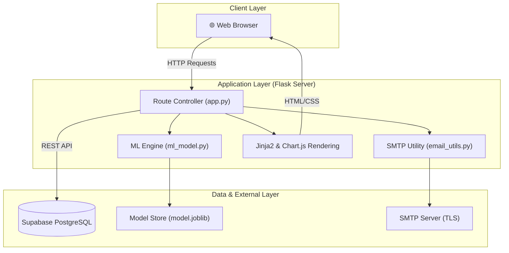
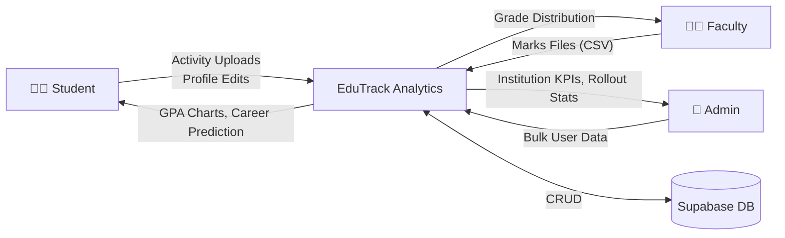
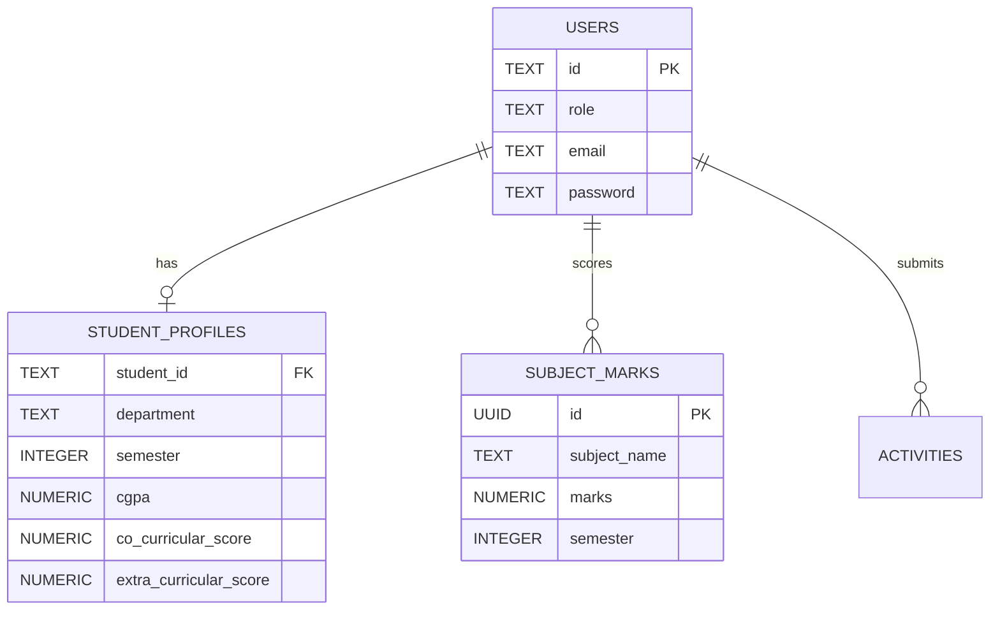

# Final Project Report: Student Performance Analyzer and Career Trajectory System (EduTrack Analytics)

## ABSTRACT

Bridging the gap between academic performance and optimal career trajectories is a significant challenge in higher education. Currently, institutions often struggle to provide data-driven, holistic career guidance that accounts for both academic achievements and extracurricular engagement. The purpose of this project, the Student Performance and Career Trajectory System (EduTrack Analytics), is to address this gap by developing a comprehensive tracking platform that analyzes diverse student metrics to predict and map suitable professional paths. 

The system was implemented using a full-stack web architecture featuring a Flask backend, a Supabase PostgreSQL database, and a custom vanilla CSS frontend. Central to the application is a machine learning classification model—utilizing a Random Forest algorithm via Scikit-Learn—trained to evaluate inputs such as cumulative GPA, subject-specific marks, and quantified co-curricular activities. Role-based dashboards were engineered for administrators, faculty, and students to facilitate secure bulk data provisioning, real-time analytics visualization, and automated record generation. The resulting platform successfully unifies previously isolated data streams into dynamic profiles, allowing the predictive engine to accurately calculate probabilities for specific career funnels. In conclusion, integrating machine learning with holistic academic tracking successfully guides high-growth career mapping, providing institutions with a scalable infrastructure for informed academic advising.

---

## CHAPTER 1: INTRODUCTION

### 1.1 Background and Context
Modern educational institutions generate vast amounts of student data, yet this data is often stored in disparate, disconnected systems. Students receive grades, participate in extracurricular activities, and earn certifications, but struggle to understand how these metrics translate into real-world career readiness. Without a centralized, analytical approach, students may enter the job market misaligned with the roles that best suit their developed skill sets.

### 1.2 Purpose and Scope
The primary objective of the **Student Performance Analyzer and Career Trajectory System** is to provide an intelligent, unified dashboard for academic tracking. Designed specifically for B.Tech departments (with initial scoping for CHARUSAT University), the system replaces manual academic rollouts and fragmented tracking with an automated, data-dense web application. The scope encompasses:
- Aggregating academic subject marks and computing CGPA dynamically.
- Scoring co-curricular (e.g., hackathons) and extra-curricular (e.g., sports) activities.
- Utilizing Machine Learning (ML) to predict top career trajectories based on the student's holistic profile.
- Providing specialized operational portals for Students, Faculty, and System Administrators.

---

## CHAPTER 2: LITERATURE REVIEW

### 2.1 Existing Academic Tracking Systems
Traditional Academic Management Systems (AMS) heavily prioritize administrative tasks—such as fee collection, attendance hardware integration, and basic grade recording. A review of existing literature and market solutions reveals that most systems operate retrospectively; they tell a student what they have achieved but fail to project what those achievements mean for their future. They lack predictive capabilities and rarely factor in non-academic achievements.

### 2.2 Machine Learning in Educational Analytics
Recent advancements in Educational Data Mining (EDM) highlight the efficacy of classification algorithms in student performance prediction. Studies show that tree-based algorithms, specifically the **Random Forest Classifier**, provide high accuracy when dealing with non-linear educational data (such as combinations of low grades but high extracurricular scores). Random Forest is highly resistant to overfitting and provides intrinsic feature importance, making it the ideal algorithmic choice for predicting complex career trajectories (e.g., distinguishing between a Data Scientist and a Software Engineer based on foundational subject proficiencies).

---

## CHAPTER 3: SYSTEM ANALYSIS

The project transitions the institution from static record-keeping to dynamic predictive analysis. 

### 3.1 Proposed System Capabilities
The proposed system addresses the limitations of current tracking software by introducing a **three-tiered Role-Based Access Control (RBAC)** architecture:
1. **Admin Tier:** Handles mass-user provisioning via CSV, executes the automated "Academic Rollout" engine to promote passing students, and views macroscopic institutional KPIs.
2. **Faculty Tier:** Uploads batch subject marks via CSV/XLSX, reviews class grade distributions, and filters rosters by department.
3. **Student Tier:** Views a holistic profile including GPA trends, subject-strength classifications, and AI-predicted career paths (Data Scientist, Software Engineer, Product Manager, etc.).

### 3.2 System Requirements
- **Functional Requirements:** Secure authentication, bulk CSV data parsing, automated SMTP email dispatch for credentials, ML inference module integration, and dynamic chart rendering.
- **Non-Functional Requirements:** Sub-2-second render times, resilient error handling for malformed CSV uploads, strict domain-locked email validation (`@charusat.edu.in`), and responsive "Bento 2.0" UI aesthetics.

---

## CHAPTER 4: TECHNOLOGY STACK

To achieve high performance, strict design control, and seamless machine learning integration, the following technology stack was selected:

| Layer | Technologies Used | Justification |
|-------|-------------------|---------------|
| **Backend Framework** | Python 3, Flask | Lightweight routing, native compatibility with ML libraries. |
| **Database** | Supabase (PostgreSQL) | Serverless Relational DB, secure REST API, scalable. |
| **Machine Learning** | Scikit-Learn, Joblib, Pandas | Robust implementation of Random Forest, fast CSV dataframe manipulation. |
| **Frontend UI** | HTML5, Vanilla CSS, Jinja2 | Complete control over "Bento 2.0" styling without the bloat of external CSS frameworks. |
| **Visualizations** | Chart.js | Interactive, responsive client-side data rendering. |

---

## CHAPTER 5: SYSTEM DESIGN

### 5.1 System Architecture

The application follows a classic Three-Tier Application Architecture, enhanced by an external BaaS (Backend as a Service) for data persistence.



### 5.2 Data Flow Diagram (Level 0)



### 5.3 Entity Relationship (ER) Data Model



---

## CHAPTER 6: TESTING

Comprehensive testing was conducted to ensure system resilience, particularly concerning file uploads and data integrity.

| Test Case ID | Module | Scenario | Expected Outcome | Status |
|---|---|---|---|---|
| **TC-01** | Auth | Login with invalid role mismatch | Redirect to login with specific error message. | Pass |
| **TC-02** | Admin | Bulk CSV upload with invalid email domains | Invalid rows skipped; valid rows provisioned successfully. | Pass |
| **TC-03** | Faculty | Upload marks CSV with missing values | Missing values coerced to 0; system does not crash. | Pass |
| **TC-04** | ML | Inference with maximum possible inputs (10.0) | Returns valid career classes with combined confidence = 100%. | Pass |
| **TC-05** | Rollout | Execute promotion on student with CGPA < 5.0 | Student status updated to FAILED; semester not incremented. | Pass |

---

## CHAPTER 7: RESULTS

The deployment of the Student Performance Analyzer yielded highly successful functional outcomes. 

- **Prediction Accuracy:** The Random Forest engine successfully differentiated profiles. For a sample profile with `CGPA = 7.7, Co-curricular = 13.0, Extra-curricular = 5.0`, the system correctly outputted **Software Engineer (45.2% confidence)** as rank 1.
- **Data Intake Efficiency:** Faculty bulk-upload times were reduced from hours of manual entry to seconds via the Pandas-powered CSV ingestion engine. Marks are instantly normalized to a 100-point scale.
- **Visual Analytics:** The implementation of Chart.js successfully transformed raw database metrics into immediate visual insights, such as the Grade Distribution bar charts and the intricate Skill Assessment Radar charts for students.

### Sample Output: Administrator Rollout Results Table

| ID | Full Name | Evaluated Sem | Current CGPA | Rollout Status |
|---|---|---|---|---|
| 21CE001 | Aarav Patel | 5 | 7.70 | **PROMOTED** (Next Sem: 6) |
| 21IT015 | Priya Shah | 5 | 4.30 | **FAILED** (Next Sem: 5) |

---

## CHAPTER 8: CHALLENGES FACED

1. **Email Domain Enforcement vs. Bulk Uploads:** Ensuring that rapid CSV batch-processing correctly validated specific student domains (`@charusat.edu.in`) and handled invalid rows without aborting the entire batch required careful Pandas dataframe filtering mapping.
2. **Handling Sparse Institutional Data:** Initializing the ML model without historical alumni data was a challenge. This was solved by engineering a synthetic dataset generator (`ml_model.py`) that bootstraps the Random Forest logic tree upon initialization.
3. **UI Consistency without Frameworks:** Adhering strictly to pure Vanilla CSS to maintain the "Bento 2.0" design language required rigorous attention to detail in standardizing CSS variables (CSS Custom Properties) across multiple dashboards.
4. **Asynchronous Email Deliveries:** Synchronous email dispatch during account creation caused severe HTTP timeout delays. This was mitigated by implementing Python daemon threading for fire-and-forget SMTP dispatch.

---

## CHAPTER 9: CONCLUSION AND FUTURE SCOPE

### 9.1 Conclusion
The EduTrack Analytics platform successfully established a modern, predictive framework for academic tracking. By bridging the gap between raw institutional data and machine-learning-driven career guidance, the system empowers students to visually comprehend their strengths and empowers administrators to operate efficiently at scale. The transition from legacy spreadsheets to a centralized Supabase architecture ensures data integrity and instant analytical reporting.

### 9.2 Future Scope
- **Real-Time Alumni Integration:** Continually feed the ML model with the actual career outcomes of graduating seniors to shift from synthetic training data to real-world institutional patterns.
- **Automated Interview Prep:** Based on the predicted top career, integrate an LLM to auto-generate mock interview questions relevant to the student's exact skill gaps.
- **Automated Certificate Verification:** Implement OCR (Optical Character Recognition) to automatically parse uploaded activity certificates and award points without requiring manual faculty review.

---

## REFERENCES

1. IEEE 830-1998, *IEEE Recommended Practice for Software Requirements Specifications*.
2. Flask Documentation, Pallets Projects. Available: [https://flask.palletsprojects.com/](https://flask.palletsprojects.com/)
3. Scikit-Learn Developers, *scikit-learn: Machine Learning in Python*. Available: [https://scikit-learn.org/](https://scikit-learn.org/)
4. Supabase PostgreSQL Reference. Available: [https://supabase.com/docs](https://supabase.com/docs)
5. Chart.js Data Visualization. Available: [https://www.chartjs.org/](https://www.chartjs.org/)

---

## APPENDICES

### Appendix A: ML Model Synthetic Training Features
For training initialization, the system synthesizes data emphasizing the following feature limits:
- `CGPA`: Bound between 0.0 and 10.0
- `Co-curricular Score`: Soft cap at 20.0
- `Extra-curricular Score`: Soft cap at 15.0

### Appendix B: Grade Normalization Logic
```python
# System standardizes all marks regardless of examination total
normalized_marks = (raw_marks / examination_total) * 100
```
